<div align="center">

# 🗺️ Tempatin

**Platform rekomendasi tempat produktif untuk mahasiswa dan pekerja remote Indonesia**

[](https://laravel.com)
[](https://livewire.laravel.com)
[](https://tailwindcss.com)
[](https://www.mysql.com)
[](https://www.php.net)

Temukan kafe, coworking space, dan perpustakaan terbaik di sekitarmu — dilengkapi rekomendasi cerdas berdasarkan fasilitas, rating, jarak, dan harga.

</div>

---

## UI/UX Preview

### Tampilan 01

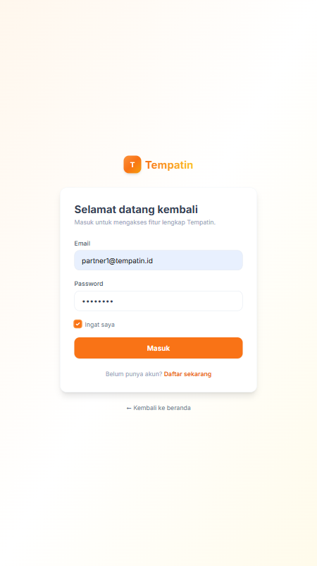

### Tampilan 02

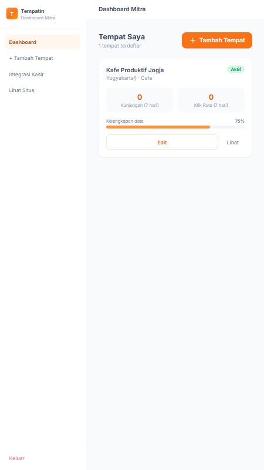

### Tampilan 03

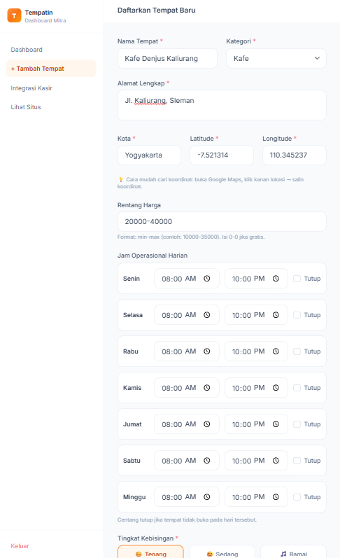

### Tampilan 04

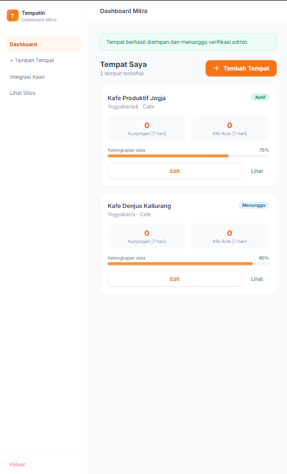

### Tampilan 05

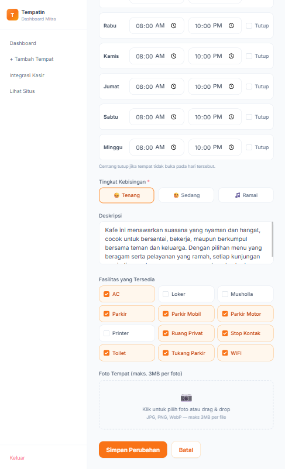

### Tampilan 06

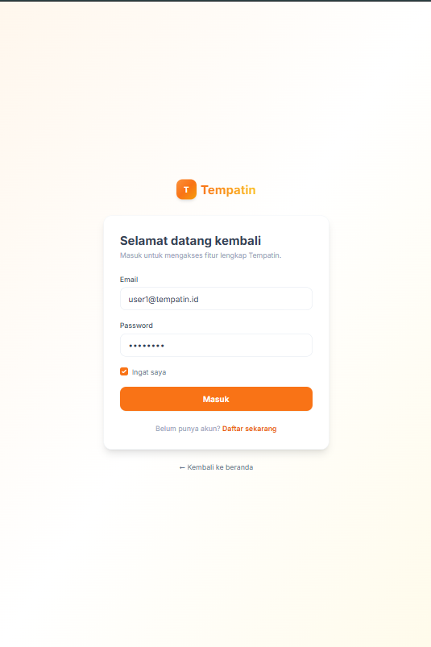

### Tampilan 07

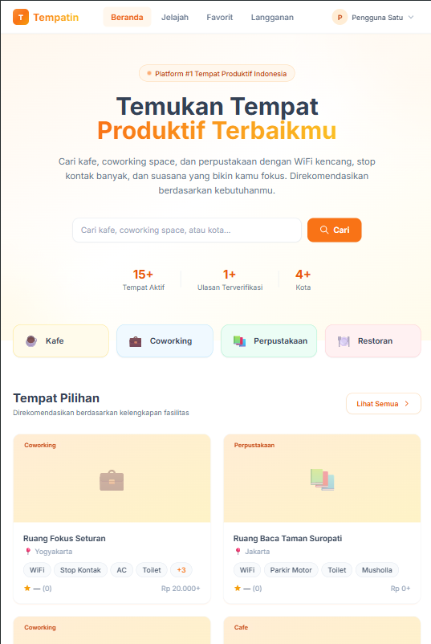

### Tampilan 08

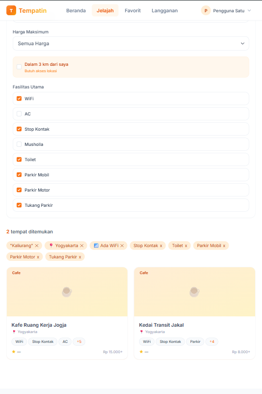

### Tampilan 09

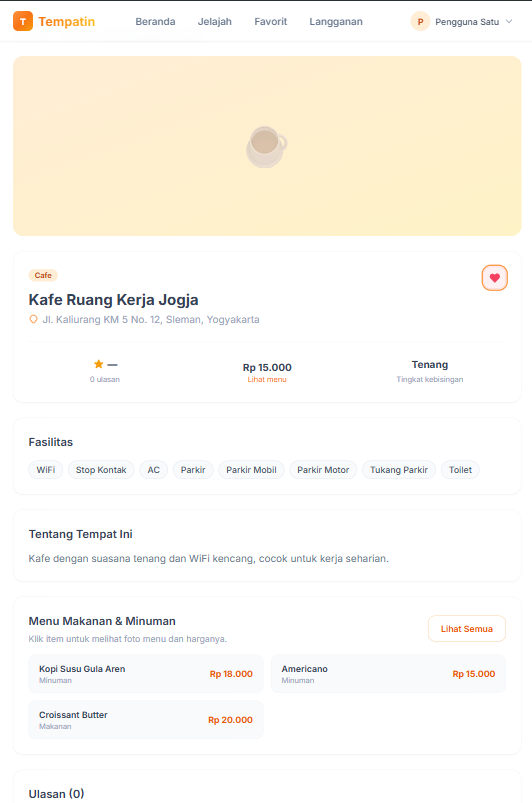

### Tampilan 10

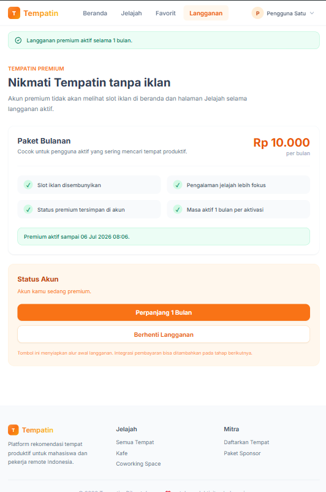

### Tampilan 11

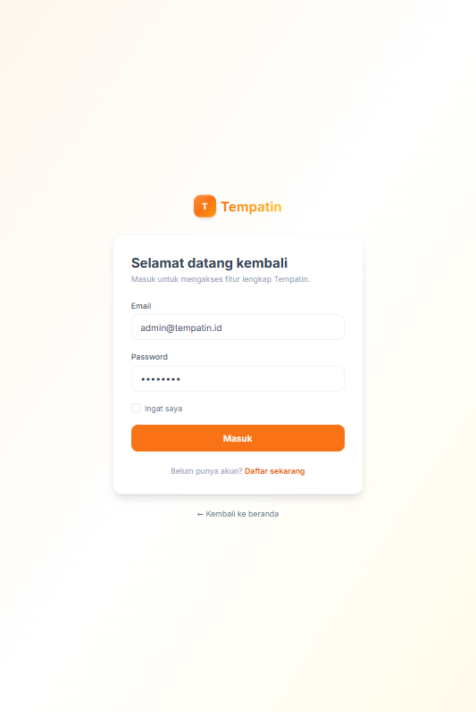

### Tampilan 12

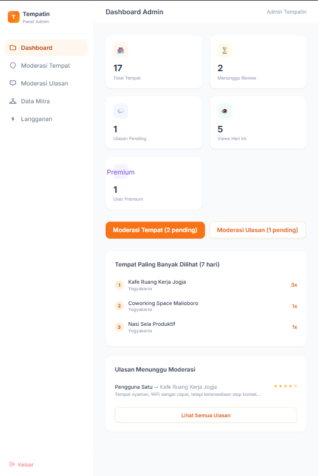

### Tampilan 13

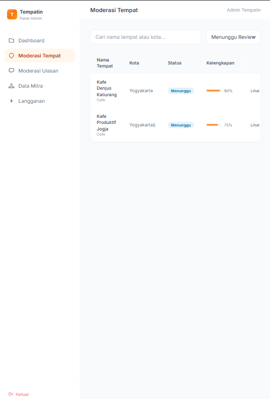

### Tampilan 14

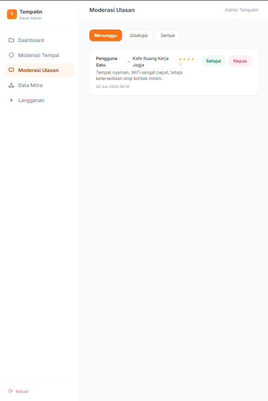

### Tampilan 15

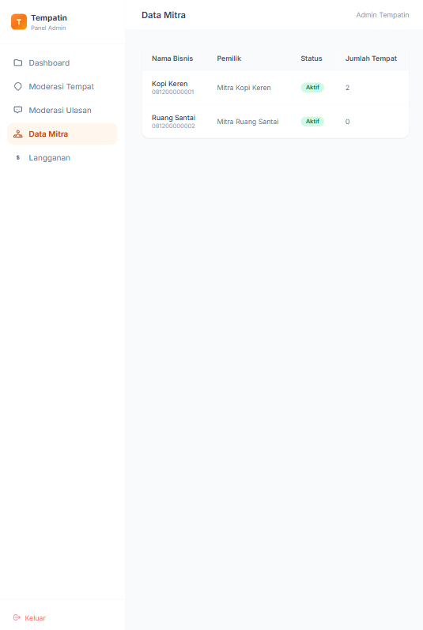

### Tampilan 16

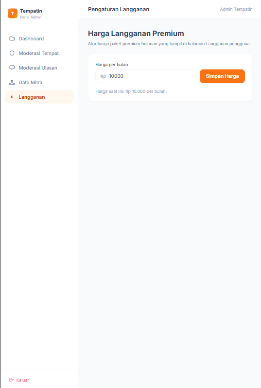

---

## ✨ Fitur

| Fitur | Keterangan |
|---|---|
| 🔍 Pencarian & Filter | Filter berdasarkan kota, fasilitas, harga, dan tingkat kebisingan |
| 📍 Deteksi Lokasi | Filter "Terdekat" menggunakan GPS browser |
| ⭐ Sistem Ulasan | Rating bintang untuk WiFi, kenyamanan, stop kontak, dan keseluruhan |
| ❤️ Favorit | Simpan tempat favorit (khusus member) |
| 🏢 Dashboard Mitra | Mitra mendaftarkan & mengelola tempat sendiri |
| 🛡️ Panel Admin | Moderasi tempat dan ulasan sebelum tayang |
| 📱 PWA | Bisa diinstall di HP seperti aplikasi native |
| 🤖 Rekomendasi Cerdas | Algoritma scoring multi-faktor |

## 🧠 Algoritma Rekomendasi

Setiap tempat mendapat skor 0–100 dari kombinasi:

```
Skor = (Fasilitas × 35%) + (Rating × 25%) + (Jarak × 20%) + (Harga × 15%) + (Kelengkapan Data × 5%)
```

> Tempat dengan promo aktif selalu ditampilkan di urutan paling atas.

## 🛠️ Tech Stack

- **Backend** — Laravel 13, Livewire v4
- **Frontend** — Tailwind CSS v3, Alpine.js
- **Database** — MySQL 8 dengan MySQL View untuk agregasi rating
- **Bundler** — Vite 6
- **Image** — Intervention Image

---

## 🚀 Instalasi & Menjalankan

### Prasyarat

Pastikan sudah terinstall:
- PHP >= 8.3
- Composer
- Node.js >= 18 & npm
- MySQL 8

### Langkah 1 — Clone & Install

```bash
git clone <url-repo> tempatin
cd tempatin

composer install
npm install
```

### Langkah 2 — Konfigurasi Environment

```bash
cp .env.example .env
php artisan key:generate
```

Edit `.env` dan sesuaikan kredensial database:

```env
DB_HOST=127.0.0.1
DB_PORT=3306
DB_DATABASE=tempatin
DB_USERNAME=root
DB_PASSWORD=
```

### Langkah 3 — Buat Database

Buat database di MySQL terlebih dahulu:

```sql
CREATE DATABASE tempatin CHARACTER SET utf8mb4 COLLATE utf8mb4_unicode_ci;
```

### Langkah 4 — Migrasi & Seed

```bash
php artisan migrate --seed
```

Perintah ini membuat semua tabel dan mengisi data awal:
- 9 fasilitas (WiFi, AC, parkir, toilet, musholla, dll.)
- 5 tempat demo di Yogyakarta & Bandung
- Akun admin dan user demo

### Langkah 5 — Link Storage

```bash
php artisan storage:link
```

### Langkah 6 — Jalankan Server

Buka dua terminal secara bersamaan:

```bash
# Terminal 1 — asset bundler
npm run dev

# Terminal 2 — Laravel
php artisan serve
```

Buka browser di **http://localhost:8000**

---

## 🔑 Akun Default

| Role  | Email             | Password |
|-------|-------------------|----------|
| Admin | admin@tempatin.id | password |
| User  | user@tempatin.id  | password |

---

## 🗂️ Struktur URL

| URL | Akses | Keterangan |
|-----|-------|------------|
| `/` | Publik | Beranda |
| `/jelajah` | Publik | Cari & filter tempat |
| `/tempat/{id}` | Publik | Detail tempat |
| `/masuk` | Publik | Login |
| `/daftar` | Publik | Registrasi |
| `/mitra/*` | Mitra | Dashboard & kelola tempat |
| `/admin/*` | Admin | Moderasi tempat & ulasan |

---

## 📁 Struktur Proyek

```
app/
├── Http/
│   ├── Controllers/        # HomeController, PlaceController, PartnerController
│   └── Middleware/         # IsAdmin, IsPartner
├── Livewire/
│   ├── Admin/              # DashboardStats, PlaceModeration, ReviewModeration
│   ├── Partner/            # Dashboard, PlaceForm
│   ├── FavoriteToggle.php
│   ├── PlaceSearch.php
│   └── ReviewForm.php
├── Models/                 # User, Place, Review, Facility, Promo, …
└── Services/
    └── RecommendationScorer.php

resources/
├── css/app.css             # Tailwind + komponen custom
├── js/app.js               # Alpine stores, PWA, geolocation helper
└── views/
    ├── components/layouts/ # Layout: app, guest, admin, partner
    ├── livewire/           # Blade untuk komponen Livewire
    ├── places/             # Halaman publik tempat
    ├── admin/              # Halaman admin
    └── partner/            # Halaman mitra

database/
├── migrations/             # 10 migrasi + 1 MySQL View (place_rating_summary)
└── seeders/                # DatabaseSeeder, FacilitySeeder, PlaceSeeder

public/
├── manifest.json           # PWA manifest
├── sw.js                   # Service Worker
└── offline.html            # Halaman offline PWA
```

---

## 📄 Lisensi

MIT License — bebas digunakan dan dimodifikasi.
